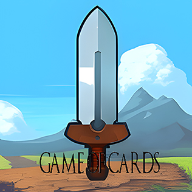
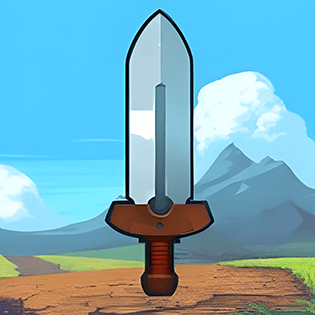

<!-- PROJECT LOGO -->
 

  

<h3 align="center">Game-of-Cards</h3>

  

    This is a Java-based software that allows players to enjoy the Game of Cards from the popular game Evoland 2. 
     
    <a href="https://github.com/gerardocipriano/pss22-Game-of-Cards"><strong>Explore the docs »</strong></a>
     
     
    ·
    <a href="https://github.com/gerardocipriano/pss22-Game-of-Cards/issues">Report Bug</a>
    ·
    <a href="https://github.com/gerardocipriano/pss22-Game-of-Cards/issues">Request Feature</a>
  

<!-- TABLE OF CONTENTS -->

  
Table of Contents

  <ol>
    <li>
      <a href="#about-the-project">About The Project</a>
    </li>
    <li>
      <a href="#getting-started">Getting Started</a>
      <ul>
        <li><a href="#installation">Installation</a></li>
      </ul>
    </li>
    <li><a href="#usage">Usage</a></li>
    <li><a href="#roadmap">Roadmap</a></li>
    <li><a href="#license">License</a></li>
    <li><a href="#contact">Contact</a></li>
  </ol>

<!-- ABOUT THE PROJECT -->
## About The Project
 

  
  

The game consists of matches played between two players on the same screen. Before the start of the game, players compose the deck of cards that both will use, or they choose one from those previously composed. In turn, two players use their cards to defeat the opponent. The game ends when the life points of one of the participants reach zero.

(<a href="#readme-top">back to top</a>)

<!-- GETTING STARTED -->
### Installation

1. Just Open the .jar provided in this repo.

(<a href="#readme-top">back to top</a>)

<!-- USAGE EXAMPLES -->
## Usage
The main screen of the software that presents different options for the user to choose from.

### Play Button
Start a game and play against another player on the same screen.

  

### Card Creation

Opens the card creation interface where the user can create custom cards.

  

(<a href="#readme-top">back to top</a>)

### Deck management

Opens the deck creation and management interface where the user can assemble and manage a deck of cards.

  

(<a href="#readme-top">back to top</a>)

### Rules

User guide with the rules of the game and information on how to play it.

  

(<a href="#readme-top">back to top</a>)

<!-- ROADMAP -->
## Roadmap

Minimum mandatory features:

- [ ] Creation of cards
- [ ] Deck creation: players can assemble a deck by selecting cards from those available through a dedicated interface.
- [ ] Management of PvP game
- [ ] Main menu
- [ ] User interface containing game rules

Optional features:

- [ ] Game audio
- [ ] Player vs CPU
- [ ] Animations for drawing and activating card effects.

(<a href="#readme-top">back to top</a>)

<!-- LICENSE -->
## License

Distributed under the MIT License. See `LICENSE` for more information.

(<a href="#readme-top">back to top</a>)

<!-- CONTACT -->
## Contact

- Massimiliano Battelli <massimilian.battelli@studio.unibo.it> 

- Ambra Benvenuti <ambra.benvenuti@studio.unibo.it> 

- Gerardo Cipriano <gerardo.cipriano@studio.unibo.it> 

- Edoardo Triossi <edoardo.triossi@studio.unibo.it> 

Project Link: [https://github.com/gerardocipriano/pss22-Game-of-Cards](https://github.com/gerardocipriano/pss22-Game-of-Cards)

(<a href="#readme-top">back to top</a>)

<!-- MARKDOWN LINKS & IMAGES -->
[license-url]: https://github.com/gerardocipriano/pss22-Game-of-Cardsblob/master/LICENSE
[product-screenshot]: src/resources/images/MainManu1c.jpg
