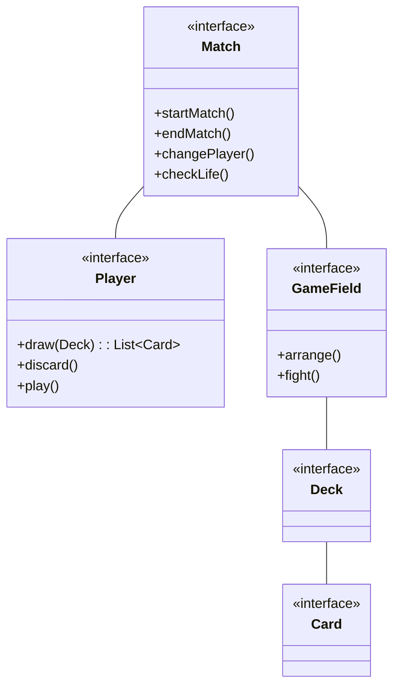
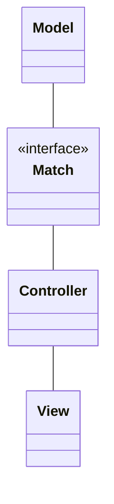
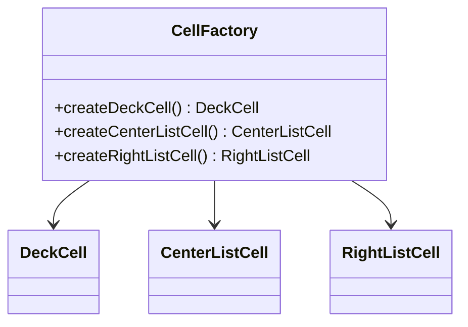
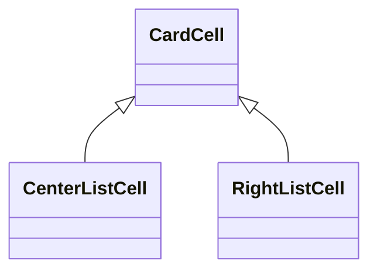

# Relazione per Progettazione e Sviluppo del Software

# Analisi

## Requisiti

Il gruppo si è posto l'obiettivo di sviluppare un software ispirato al gioco di carte di Evoland 2 (“Game of Cards”).  

Il gioco si compone di partite disputate tra due giocatori su uno stesso schermo. Prima dell’inizio della partita i giocatori compongono il mazzo di carte che entrambi utilizzeranno oppure ne scelgono uno tra quelli composti in precedenza. A turno, due giocatori utilizzano le proprie carte per sconfiggere l'avversario. La partita finisce quando i punti vita di uno dei partecipanti arrivano a zero.

### Requisiti funzionali 

- [ ] <b>Creazione delle carte</b>: i giocatori attraverso un’apposita interfaccia possono creare delle carte personalizzate specificando per ciascuna il nome della carta, punti vita, costo, attacco, difesa e abilità 

- [ ] <b>Creazione del mazzo</b>: i giocatori attraverso un’apposita interfaccia possono assemblare un mazzo scegliendo tra tutte le carte a disposizione 

- [ ] <b>Gestione della partita player vs player</b>: la partita si svolgerà su un campo di gioco suddiviso in 12 caselle in formato 4x3 e diviso in due parti speculari (una per giocatore). Durante il proprio turno, ogni giocatore potrà posizionare le carte nella propria parte di campo. Alla fine del turno le carte in campo si scontreranno contro quelle dell’avversario, eliminandosi a vicenda o sottraendo punti vita all’avversario.   

- [ ] <b>Menu principale</b>: il software si aprirà dalla schermata principale, dove l'utente troverà un menu che gli permetterà di scegliere se iniziare una nuova partita o accedere alle altre funzionalità. Inoltre, sarà presente un tutorial per coloro che vogliono rinfrescare le regole del gioco. 

### Requisiti non funzionali 

- [ ] <b>Impostazioni</b>: gestione dell'audio e fullscreen dell'applicazione

- [ ] <b>Sviluppo di una modalità di gioco player vs CPU</b>: implementazione di una seconda modalità di gioco in cui un singolo giocatore potrà sfidare il software 

- [ ] <b>Animazioni</b> di pescata e attivazione effetto delle carte durante la partita 

### Elementi positivi

-   Si fornisce una descrizione in linguaggio naturale di ciò che il
    software dovrà fare.
-   Gli obiettivi sono spiegati con chiarezza, per punti.
-   Se vi sono termini il cui significato non è immediatamente
    intuibile, essi vengono spiegati.
-   Considerato a un paio di pagine un limite ragionevole alla lunghezza
    della parte sui requisiti, in quello spazio si deve cercare di
    chiarire *tutti* gli aspetti dell'applicazione, non lasciando
    decisioni che impattano la parte "esterna" alla discussione del
    design (che dovrebbe solo occuparsi della parte "interna").

### Elementi negativi

-   Si forniscono indicazioni circa le soluzioni che si vogliono
    adottare.
-   Si forniscono dettagli di tipo tecnico o implementativo (parlando di
    classi, linguaggi di programmazione, librerie, eccetera).

## Analisi e modello del dominio

All’interno della partita entrano in gioco diverse entità. I giocatori si affrontano con lo stesso mazzo. I mazzi sono composti da diverse carte. Le carte sono posizionate sul terreno di gioco. 
I giocatori hanno a disposizione una certa quantità di punti vita e di mana. Quando i punti vita di uno dei giocatori arriva a 0, il gioco termina. Il mana a disposizione dei giocatori è utilizzato per evocare le varie carte che si pescano.  

Prima della partita, è possibile comporre un deck con le carte a disposizione. Ogni deck ha un nome e l’elenco delle carte da cui è composto. Le carte sono posizionate su un campo di gioco.  

Il campo è composto da una griglia in formato 4x3 e diviso in due parti speculari, una per giocatore. Durante il turno di ciascun giocatore, è possibile decidere dove posizionare le carte sul campo. 

Il Match è un'entità astratta che lega fra di loro il Giocatore e il campo di gioco. Si occupa di gestire la logica di gioco come l'inzio e la fine di una partita.

Data la complessità di elaborare una strategia di gioco per il computer, la prima versione software fornita non prevederà la modalità giocatore 1 versus CPU.
 

# Design

## Architettura

L'architettura di Game of Cards segue il pattern architetturale MVC, in cui ogni aspetto funziona in autonomia per garantire un'organizzazione efficiente. In particolare, l'intero modello si basa sulla classe Match che coordina tutte le funzionalità della partita che abbiamo aggiunto. Ogni volta che si verificano eventi sul terreno di gioco, quest'ultimo notifica i cambiamenti al controller del Match; il controller si occuperà poi di aggiornare di conseguenza gli elementi grafici. In questo modo, possiamo garantire il funzionamento dell'applicazione anche se si dovesse optare per una GUI diversa, senza essere vincolati ad una libreria grafica specifica.

## Design dettagliato

### Massimiliano Battelli
Il mio ruolo all'interno del gruppo prevedeva principalmente di sviluppare
la sezione riguardante la gestione dei mazzi, ovvero creazione cancellazione 
e modifica e la relativa GUI. In aggiunta ho implementato la lettura e il 
salvataggio di essi nel file JSON. L'interfaccia dovrà mostrare le carte
e i mazzi disponibili, dare la possibilità all'utente di selezionare 
le carte e salvarle in un mazzo. I mazzi possono venire cancellati
e interagiti per visualizzarne le carte.  
Ho utilizzato 3 liste verticali per visualizzare i mazzi, le carte contenute
in ogni mazzo e le carte disponibili, dando modo all'utente di interagire con ogni 
elemento.

**Creazione celle nelle liste**

Rappresentazione UML del pattern Factory per le celle

**Problema**  
L'interfaccia presenta 3 liste verticali per visualizzare i mazzi, 
le carte del mazzo selezionato, e le carte totali disponibili.
Ognuna di esse deve avere un'implementazione della propria cella,
diversa per ogni lista.

**Soluzione**
Utilizzare il _pattern Factory Method_ per creare automaticamente
le celle corrette per ogni lista di oggetti.
Il metodo della classe factory implementato viene chiamato dalla classe
controller principale dell'interfaccia e reinderizza le suddette celle di ogni lista.

**Celle nelle liste di carte**

Rappresentazione UML del pattern Template per le celle delle carte

**Problema**
Sia la lista centrale che quella sulla destra contengono delle celle di carte che
però differiscono per la funzionalità del pulsante, uno elimina la cella
l'altro l'aggiunge al mazzo.

**Soluzione**
Creare una classe padre CardCell che contiente le funzionalità comuni
alle due celle che poi verrà estesa tramite il pattern _Template Method_.
 

