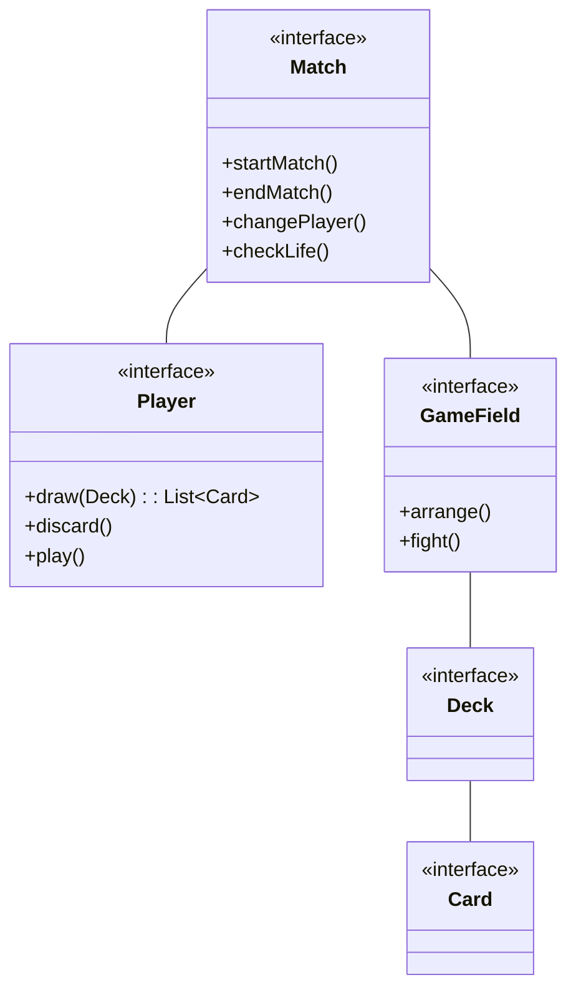
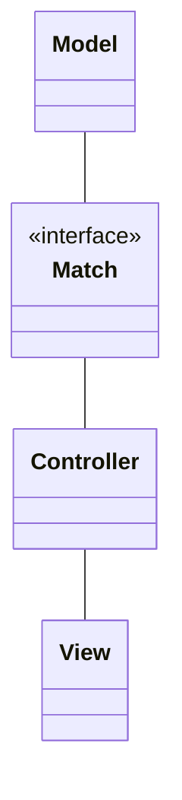
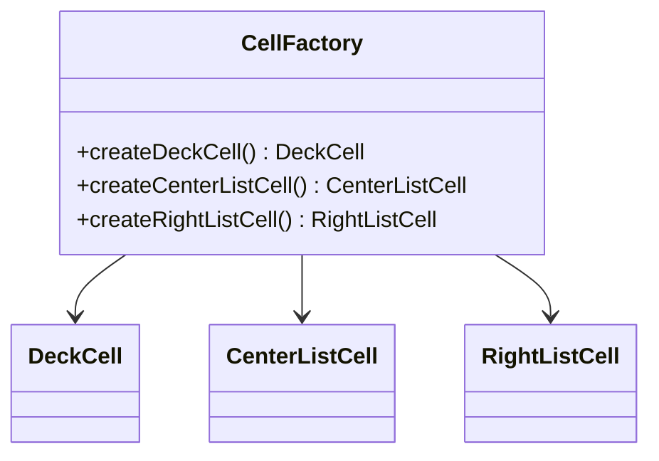
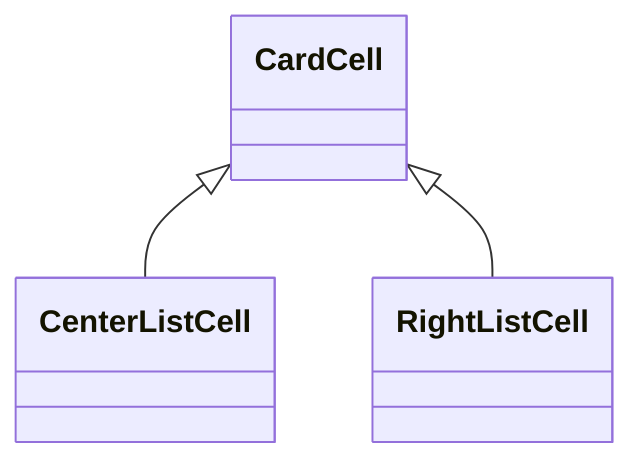
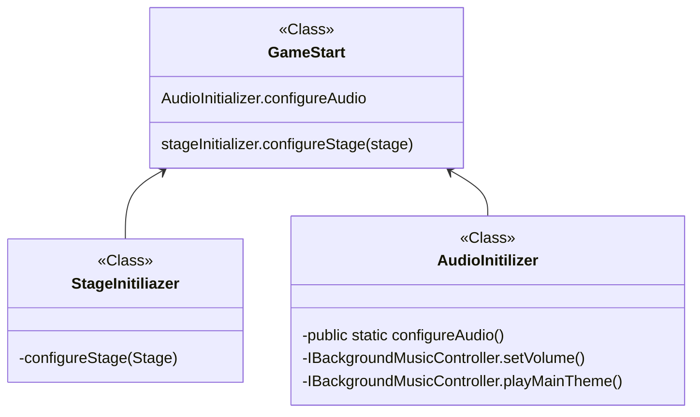
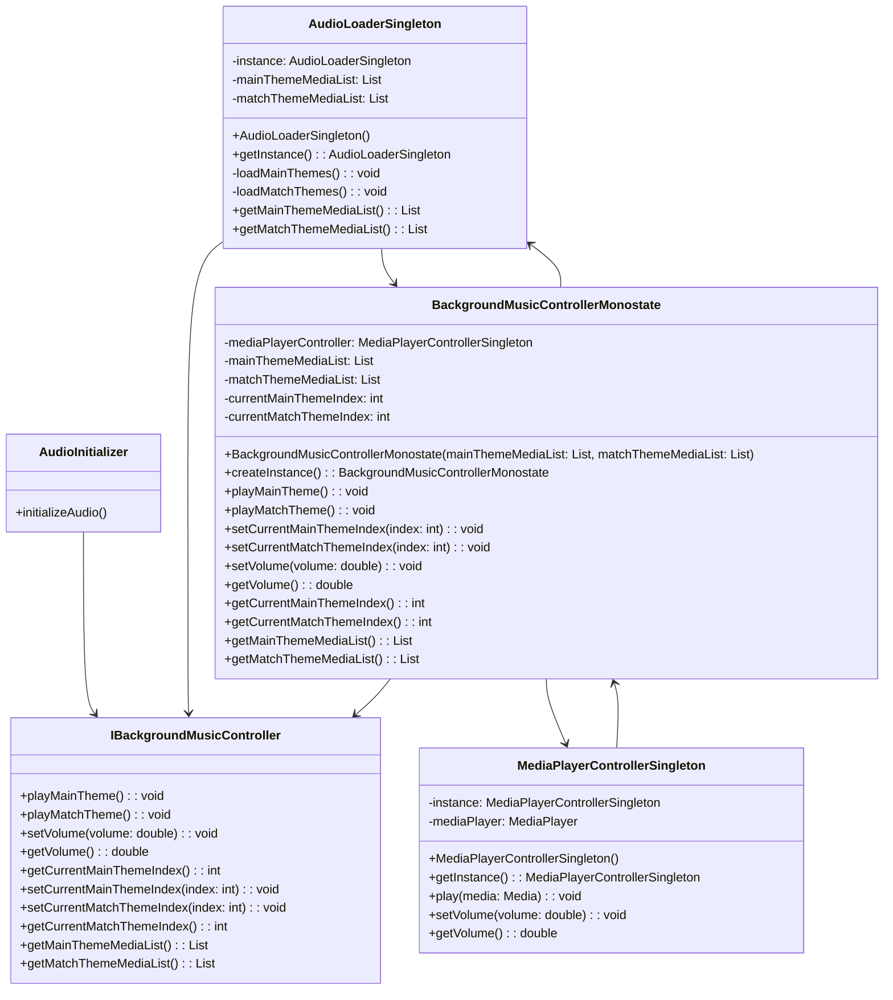
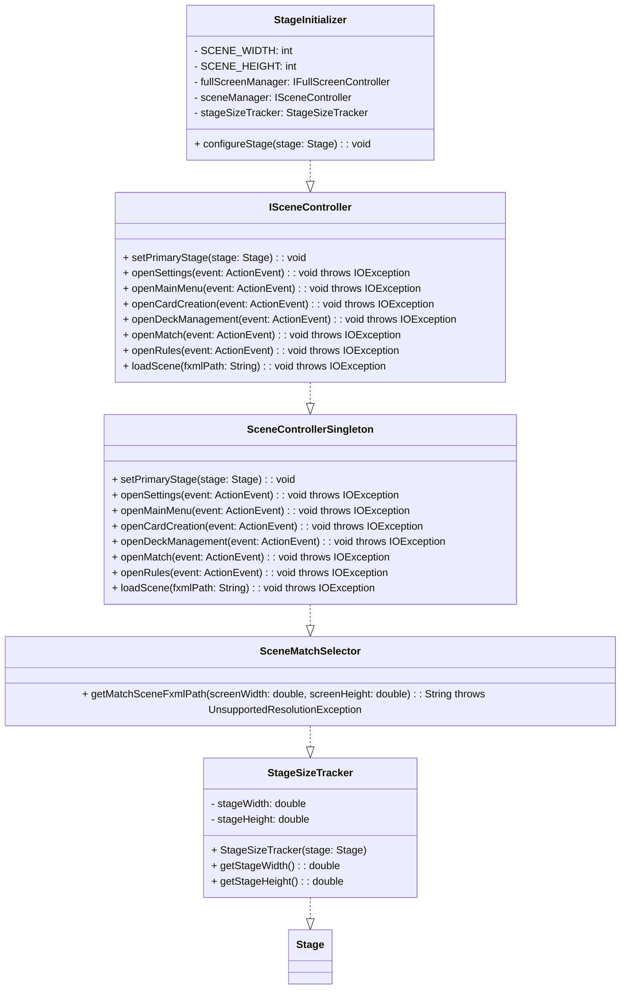

# Relazione per Progettazione e Sviluppo del Software

# Analisi

## Requisiti

Il gruppo si è posto l'obiettivo di sviluppare un software ispirato al gioco di carte di Evoland 2 (“Game of Cards”).

Il gioco si compone di partite disputate tra due giocatori su uno stesso schermo. Prima dell’inizio della partita i giocatori compongono il mazzo di carte che entrambi utilizzeranno oppure ne scelgono uno tra quelli composti in precedenza. A turno, due giocatori utilizzano le proprie carte per sconfiggere l'avversario. La partita finisce quando i punti vita di uno dei partecipanti arrivano a zero.

### Requisiti funzionali

- [ ] <b>Creazione delle carte</b>: i giocatori attraverso un’apposita interfaccia possono creare delle carte personalizzate specificando per ciascuna il nome della carta, punti vita, costo, attacco, difesa e abilità

- [ ] <b>Creazione del mazzo</b>: i giocatori attraverso un’apposita interfaccia possono assemblare un mazzo scegliendo tra tutte le carte a disposizione

- [ ] <b>Gestione della partita player vs player</b>: la partita si svolgerà su un campo di gioco suddiviso in 12 caselle in formato 4x3 e diviso in due parti speculari (una per giocatore). Durante il proprio turno, ogni giocatore potrà posizionare le carte nella propria parte di campo. Alla fine del turno le carte in campo si scontreranno contro quelle dell’avversario, eliminandosi a vicenda o sottraendo punti vita all’avversario.

- [ ] <b>Menu principale</b>: il software si aprirà dalla schermata principale, dove l'utente troverà un menu che gli permetterà di scegliere se iniziare una nuova partita o accedere alle altre funzionalità. Inoltre, sarà presente un tutorial per coloro che vogliono rinfrescare le regole del gioco.

### Requisiti non funzionali

- [ ] <b>Impostazioni</b>: gestione dell'audio e fullscreen dell'applicazione

- [ ] <b>Sviluppo di una modalità di gioco player vs CPU</b>: implementazione di una seconda modalità di gioco in cui un singolo giocatore potrà sfidare il software

- [ ] <b>Animazioni</b> di pescata e attivazione effetto delle carte durante la partita

## Analisi e modello del dominio

All’interno della partita entrano in gioco diverse entità. I giocatori si affrontano con lo stesso mazzo. I mazzi sono composti da diverse carte. Le carte sono posizionate sul terreno di gioco.
I giocatori hanno a disposizione una certa quantità di punti vita e di mana. Quando i punti vita di uno dei giocatori arriva a 0, il gioco termina. Il mana a disposizione dei giocatori è utilizzato per evocare le varie carte che si pescano.

Prima della partita, è possibile comporre un deck con le carte a disposizione. Ogni deck ha un nome e l’elenco delle carte da cui è composto. Le carte sono posizionate su un campo di gioco.

Il campo è composto da una griglia in formato 4x3 e diviso in due parti speculari, una per giocatore. Durante il turno di ciascun giocatore, è possibile decidere dove posizionare le carte sul campo.

Il Match è un'entità astratta che lega fra di loro il Giocatore e il campo di gioco. Si occupa di gestire la logica di gioco come l'inzio e la fine di una partita.



Data la complessità di elaborare una strategia di gioco per il computer, la prima versione software fornita non prevederà la modalità giocatore 1 versus CPU.

# Design

## Architettura

L'architettura di Game of Cards segue il pattern architetturale MVC, in cui ogni aspetto funziona in autonomia per garantire un'organizzazione efficiente. In particolare, l'intero modello si basa sulla classe Match che coordina tutte le funzionalità della partita che abbiamo aggiunto. Ogni volta che si verificano eventi sul terreno di gioco, quest'ultimo notifica i cambiamenti al controller del Match; il controller si occuperà poi di aggiornare di conseguenza gli elementi grafici. In questo modo, possiamo garantire il funzionamento dell'applicazione anche se si dovesse optare per una GUI diversa, senza essere vincolati ad una libreria grafica specifica.



## Design dettagliato

### Massimiliano Battelli

Il mio ruolo all'interno del gruppo prevedeva principalmente di sviluppare
la sezione riguardante la gestione dei mazzi, ovvero creazione cancellazione
e modifica e la relativa GUI. In aggiunta ho implementato la lettura e il
salvataggio di essi nel file JSON. L'interfaccia dovrà mostrare le carte
e i mazzi disponibili, dare la possibilità all'utente di selezionare
le carte e salvarle in un mazzo. I mazzi possono venire cancellati
e interagiti per visualizzarne le carte.  
Ho utilizzato 3 liste verticali per visualizzare i mazzi, le carte contenute
in ogni mazzo e le carte disponibili, dando modo all'utente di interagire con ogni
elemento.

**Creazione celle nelle liste**

Rappresentazione UML del pattern Factory per le celle



**Problema**  
L'interfaccia presenta 3 liste verticali per visualizzare i mazzi,
le carte del mazzo selezionato, e le carte totali disponibili.
Ognuna di esse deve avere un'implementazione della propria cella,
diversa per ogni lista.

**Soluzione**
Utilizzare il _pattern Factory Method_ per creare automaticamente
le celle corrette per ogni lista di oggetti.
Il metodo della classe factory implementato viene chiamato dalla classe
controller dell'interfaccia e renderizza le suddette celle in ogni lista.

**Celle nelle liste di carte**

Rappresentazione UML del pattern Template per le celle delle carte



**Problema**
Sia la lista centrale che quella sulla destra contengono delle celle di carte che
però differiscono per la funzionalità del pulsante, uno elimina la cella
l'altro l'aggiunge al mazzo.

**Soluzione**
Creare una classe padre CardCell che contiente le funzionalità comuni
alle due celle che poi verrà estesa tramite il pattern _Template Method_.

### Gerardo Cipriano

Nel gruppo sono stato incaricato dello sviluppo del Launcher, delle Impostazioni e del Regolamento del gioco. Ho strutturato il mio lavoro in modo da esporre quante più funzionalità possibili, in modo da facilitare il lavoro dei miei colleghi. Per il Launcher, ho scelto di usare JavaFX come libreria grafica per il nostro progetto. Ho creato la classe GameStart come punto di ingresso dell’applicazione. Ho reso questa classe quanto più semplice e chiara possibile, affidando singoli compiti di inizializzazione (come la creazione dello Stage e l’avvio dell’Audio) ad altre classi. Suddividendo le tre inizializzazioni in operazioni atomiche, ho ottenuto un codice molto leggibile, riusabile e scalabile, indipendente dalle diverse implementazioni di Audio e Video.



Questa semplificazione ha permesso di eliminare codice ripetitivo in ciascuna delle classi di test delle singole scene, le quali devono solo invocare il metodo Start

**Problema**
Nel template FXML i pulsanti richiamano direttamente metodi contenuti nel controller della scena. Inoltre il codice è ripetitivo.

**Soluzione**
JavaFX offre la possibilità di specificare nel template FXML i metodi da invocare per ciascun nodo dell’interfaccia grafica. Tuttavia, questo approccio non è consigliabile perché rende la view dipendente dal comportamento dei nodi. Inoltre, alcuni pulsanti hanno un comportamento simile o parzialmente condiviso con altri, il che comporta la duplicazione di codice nei vari metodi di gestione dell’evento. Per ovviare a questo problema, ho applicato il Command Pattern, un pattern comportamentale che permette di incapsulare in un oggetto tutte le informazioni necessarie per eseguire un’azione (command), compreso il metodo da chiamare, gli argomenti del metodo e l’oggetto (receiver) che implementa il metodo. Ho identificato una serie di azioni che i pulsanti dovevano eseguire e le ho incapsulate in diverse classi che implementano l’interfaccia IButtonCommand. Nel metodo initialize() di ciascun controller ho associato ad ogni pulsante una lista di comandi da eseguire quando viene premuto. In questo modo, posso personalizzare la combinazione di comandi per ogni pulsante e modificarla facilmente senza dover intervenire sul codice dei metodi initialize() dei controller. I comandi che ho scritto io sono relativi allo Screen (attiva, disattiva, switch full screen), Sound (riproduci clip, passa a musica principale, passa a musica del match) e Scene (cambia la scena); è stato utilizzato anche da altri miei colleghi.

**Problema**
Gestire l’audio di gioco in modo efficiente e consentire all’utente di scegliere il tema musicale preferito

**Soluzione**
Per la risoluzione di questo task ho seguito un approccio orientato alle prestazioni. Sapevo che la creazione dell’oggetto MediaPlayer era un’operazione costosa da ripetere ogni volta che si doveva riprodurre una traccia audio, quindi ho dovuto trovare una soluzione alternativa, sfruttando il Singleton Pattern1. Questo non è stato l’unico problema, perché dovevo anche gestire il cambio della musica da MainTheme a MatchTheme quando si entrava nella scena del Match. Dalle impostazioni dovevo fornire all’utente la possibilità di selezionare tra una lista di temi principali e di battaglia, e mantenere questa preferenza fino alla chiusura del programma. Ho seguito anche un approccio orientato al rispetto del principio SOLID. Per questo ho cercato di assegnare una singola responsabilità ad ogni classe dello schema.



IBackgroundMusicController è l’interfaccia che espone i metodi per gestire i temi musicali principali e di battaglia, il volume e gli indici dei temi selezionati. BackgroundMusicControllerMonostate implementa questa interfaccia usando il pattern Monostate per condividere lo stato tra le istanze e controllare l’audio da qualsiasi parte del programma. Questa classe si appoggia a MediaPlayerControllerSingleton, che usa il pattern Singleton per avere un solo oggetto MediaPlayer responsabile della riproduzione dell’audio. Questa classe offre i metodi per riprodurre un Media e regolare il volume. Infine, AudioLoaderSingleton usa il pattern Singleton per caricare le risorse audio dai file .mp3 nelle cartelle MainThemes e MatchThemes e restituire le liste dei Media corrispondenti ai temi musicali.

Ho scelto il Monostate per BackgroundMusicControllerMonostate perché volevo avere più istanze con lo stesso stato e non potevo usare il Singleton a causa del costruttore (ciascuna istanza doveva dipendere dalle liste passate). Ho scelto il Singleton per AudioLoaderSingleton e MediaPlayerControllerSingleton perché volevo avere una sola istanza (riutilizzo del mediaplayer) e garantire l’accesso globale a essa (la lista dei temi disponibili serve anche per generare gli item della choicebox per selezionare il tema).
Ogni classe rispetta il SRP.

**Problema**
Gestire il cambio delle scene in modo efficiente e lineare. Gestire l'accesso alla scena del Match da schermi di risoluzioni non supportate

**Soluzione**
La gestione efficiente e lineare del cambio delle scene e l'accesso alla scena del Match da schermi di risoluzioni non supportate richiedono una progettazione attenta. Per risolvere questo problema, ho progettato una soluzione basata sul seguente schema UML:



L'interfaccia ISceneController definisce i metodi per aprire le varie scene del gioco, separando la gestione delle scene dalla logica di business e garantendo modularità e flessibilità.
La classe StageInitializer inizializza la finestra principale del gioco e setta il primary stage alla classe concreta SceneControllerSingleton per consentirle di aprire le varie scene.
La classe StageSizeTracker monitora le dimensioni della finestra principale del gioco e solleva un'eccezione se le dimensioni non sono supportate per evitare l'accesso alla scena di gioco con dimensioni non supportate.
La classe SceneMatchSelector restituisce il percorso del file FXML per la scena di gioco, in base alle dimensioni della finestra principale del gioco, utilizzando il metodo getMatchSceneFxmlPath() che viene utilizzato dalla classe ISceneController per caricare la scena di gioco.
La soluzione proposta presenta i vantaggi di separare le responsabilità, riutilizzare il codice e monitorare le dimensioni della finestra per prevenire l'accesso alla scena di gioco con dimensioni non supportate. Tuttavia, presenta anche lo svantaggio di essere più complessa a causa dell'utilizzo di diverse classi e interfacce, e la dipendenza della classe concreta SceneControllerSingleton dalla classe StageInitializer potrebbe rendere il codice meno modulare.

# Sviluppo

## Testing automatizzato

Per testare la nostra applicazione abbiamo usato dei test automatizzati
che comprendevano tutte le interfaccie dell'applicazione tramite le
librerie jUnit e TestFX. In ogni test veniva controllato che l'interfaccia
considerata eseguiva le corrette funzionalità principali:

- **MainMenuTest**: Verifica che ogni pulsante del menu principale apra la
  propria interfaccia.
- **DeckManagementTest**: Verifica che le carte siano state caricate nella
  propria lista, controlla che il processo di salvataggio di un deck e il
  pulsante per tornare alla pagina precedente funzionino.
- **RulesTest**: Verifica che il numero e il contenuto dei tab creati corrisponda a quelli definiti nelle entry del file properties
- **SettingsTest**: Verifica che le funzionalità di toggle full screen, cambio traccia e volume audio funzionino

## Note di sviluppo

### Massimiliano Battelli

#### Utilizzo della libreria Gson

**Dove**: classi DeckParser, CardParser, `package utilities.parser.DeckParser`, `package utilities.parser.CardParser`

**Permalink**: https://github.com/gerardocipriano/pss22-Game-of-Cards/blob/9ccbfa3aa27f65917c18ceb1fb6756621f138c89/src/main/java/utilities/parser/DeckParser.java

**Snippet**

```java
    public static void writeDecks(List<Deck> decks){
        Gson gson = new Gson();
        String json = gson.toJson(decks);
        System.out.println(json);

        try (FileWriter writer = new FileWriter("./src/main/resources/json/decks.json")) {
            writer.write(json);
            writer.close();
        } catch (IOException e) {
            e.printStackTrace();
        }
    }
```

**Descrizione**: Ho utilizzato questa libreria per gestire il parsing delle
carte e dei mazzi la quale permette di convertire degli oggetti nella loro
rappresentazione JSON e viceversa tramite semplici metodi: .toJson e .fromJson.

#### Passare l'oggetto Carta corretto al comando AddCard

**Dove**: classi RightListCell, CenterListCell, `package model.deckmanagement.RightListCell`, `package model.deckmanagement.CenterListCell`

**Permalink**: https://github.com/gerardocipriano/pss22-Game-of-Cards/blob/282c0d81c1d18a6558a7ff7e4f7958ec46918217/src/main/java/model/deckmanagement/RightListCell.java

**Snippet**

```java
    public RightListCell(ListView<Card> centerList) {
        super(centerList);
        this.centerList = centerList;

        buttonCommands.add(new AddCard(this, this.centerList));
        buttonCommands.add(new PlayClipCommand());
        MacroCommand buttonMacro = new MacroCommand(buttonCommands);

        cellButton.setOnAction(event -> {
            Card card = getItem();
            for (IButtonCommand command : buttonCommands) {
                if (command instanceof AddCard) {
                    ((AddCard) command).setCard(card);
                }
            }
            buttonMacro.execute();
        });
    }
```

**Descrizione**: Per passare correttamente la carta selezionata
al comando di AddCard(aggiunta alla lista centrale) era necessario
apprendere l'oggetto della cella di cui viene premuto il pulsante,
e utilizzare un metodo del comando per settare la carta, avendo più comandi
nella macro è stato usato in ciclo for. Non era possibile passare la carta
al costruttore di AddCard perchè non avrebbe avuto nessun riferimento.

#### Uso di Optional per il confirmation dialog

**Dove**: classi InputValidator `package utilities.InputValidator`

**Permalink**: https://github.com/gerardocipriano/pss22-Game-of-Cards/blob/30a3dd52d2a7e33a9c805707d98ba794a631d687/src/main/java/utilities/InputValidator.java

**Snippet**

```java
    if (deckName.equals(existingDeckName)){
            Optional<ButtonType> result = showConfirmationDialog("Do you want to overwrite the existing deck?", window);
            if (result.isPresent() && result.get() == ButtonType.OK) {
                return true;
            } else {
                return false;
            }
        } else {
            return true;
        }
```

**Descrizione**: Nel caso esista già un mazzo con lo stesso nome
appare un dialog di conferma, il return di tipo Optional serve
a gestire il caso che l'utente non accetti il dialog e quindi
la variabile result conterrà un null value.

### Gerardo Cipriano

#### Utilizzo della libreria JavaFX

**Dove**: `package view.*`, `package controller.fxml.{MainMenu, Settings, Rules}`

**Permalink**: https://github.com/gerardocipriano/pss22-Game-of-Cards/blob/02937813b833eaa674588e0d36a67d1bf0420f85/src/main/java/view/rules/TabViewFactory.java

**Snippet**

```java
    public Tab createTab(String key) {
        Tab tab = new Tab(key);
        SplitPane splitPane = new SplitPane();
        AnchorPane anchorPane1 = new AnchorPane();
        Text text = new Text(properties.getProperty(key));
        text.setLayoutX(14.0);
        text.setLayoutY(44.0);
        text.setWrappingWidth(600.0);
        anchorPane1.getChildren().add(text);
        AnchorPane anchorPane2 = new AnchorPane();
        ImageView imageView = new ImageView();
        imageView.setFitHeight(450.0);
        imageView.setFitWidth(600.0);
        imageView.setLayoutX(14.0);
        imageView.setLayoutY(14.0);
        imageView.setPickOnBounds(true);
        imageView.setPreserveRatio(true);
        try {
            Image image = new Image("/images/" + key + ".jpg");
            imageView.setImage(image);
        } catch (Exception e) {
            // Image not found, use default image
            Image image = new Image("/images/img-not-found.jpg");
            imageView.setImage(image);
        }
        anchorPane2.getChildren().add(imageView);
        splitPane.getItems().addAll(anchorPane1, anchorPane2);
        tab.setContent(splitPane);
        return tab;
    }
```

**Descrizione**: La View principalmente è tutta definita nei file .fxml. Ci sono alcuni elementi che volevo creare in modo dinamico.
In questo caso il codice si occupa di generare dei Tab per ciascuna sezione del regolamento (speficicati in un file properties).
Ho seguito un approccio simile per la generazione degli Item nella ChoiceBox dei temi musicali.

#### Utilizzo della libreria TestFX

**Dove**: `package test.controller.fxml.{MainMenuTest, SettingsTest, RulesTest}`

**Permalink**: https://github.com/gerardocipriano/pss22-Game-of-Cards/blob/02937813b833eaa674588e0d36a67d1bf0420f85/src/test/java/controller/fxml/SettingsTest.java

**Snippet**

```java
    @Test
    public void testMusicAudioLevelSlider() {
        // Get the current value of the slider
        double oldValue = settingsController.getMusicAudioLevelSliderValue();
        settingsController.setMusicAudioLevelSliderValue(50);
        // Simulate a drag of the slider to change its value
        drag("#musicAudioLevelSlider").dropBy(40, 0);

        // Verify that the value of the slider has changed
        double newValue = settingsController.getMusicAudioLevelSliderValue();
        assertNotEquals(oldValue, newValue);

        // Verify that the music volume has changed accordingly
        assertEquals(newValue / 100, bgMusic.getVolume(), 0.01);
    }
```

**Descrizione**: I test come accennato anche prima, fanno massiccio uso dei metodi messi a disposizione da TestFX. Questo particolare metodo testa che allo spostamento dello slider del volume, corrisponda un effettiva variazione del livello.

#### Utilizzo di lambda expressions

**Dove**: `package controller.fxml.{MainMenuTest, SettingsTest, RulesTest}`

**Permalink**: https://github.com/gerardocipriano/pss22-Game-of-Cards/blob/02937813b833eaa674588e0d36a67d1bf0420f85/src/main/java/controller/fxml/Settings.java

**Snippet**

```java
        Platform.runLater(() -> {
            int currentMainThemeIndex = bgMusic.getCurrentMainThemeIndex();
            choiceMainTheme.getSelectionModel().select(currentMainThemeIndex);

            int currentMatchThemeIndex = bgMusic.getCurrentMatchThemeIndex();
            choiceMatchTheme.getSelectionModel().select(currentMatchThemeIndex);
        });
```

**Descrizione**: La lambda expression viene utilizzata come parametro del metodo runLater() della classe Platform. Questo metodo fa parte della JavaFX API e viene utilizzato per eseguire il codice specificato in un thread separato, diverso dal thread di interfaccia utente, in modo che l'interfaccia utente non si blocchi. La lambda expression viene eseguita in questo thread separato e contiene del codice che imposta alcune proprietà di oggetti della UI (choiceMainTheme e choiceMatchTheme).
